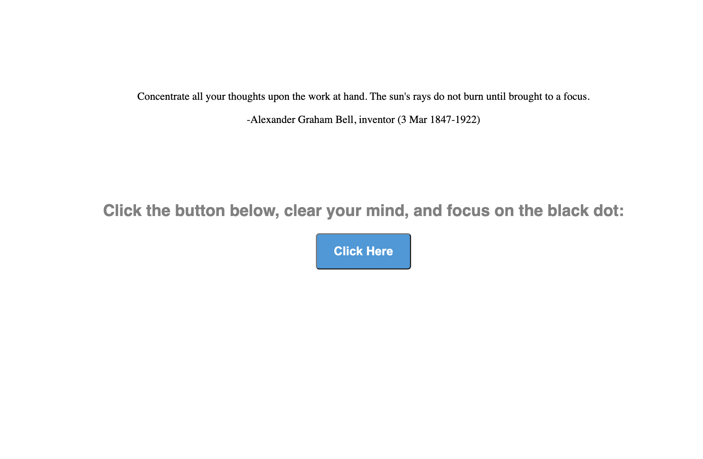

# Focus Exercise App

This is a simple web application designed for a focus exercises. 
It includes a quote about concentration and a button that, when clicked, prompts the user to clear their mind and focus on a growing and shrinking black dot.

## Usage

1. Open `index.html` in your web browser.
2. Click the "Click Here" button.
3. Clear your mind and focus on the growing and shrinking black dot.

## Quote

> "Concentrate all your thoughts upon the work at hand. The sun's rays do not burn until brought to a focus."
>
> \- **Alexander Graham Bell**, inventor (3 Mar 1847-1922)

## How it Works

- The app utilizes HTML, CSS, and JavaScript.
- The button triggers an animation that grows and shrinks a black dot in the center of the screen.
- Between inhales and exhales, there is a short pause of a random duration (between 0 and 3 seconds).
- The animation continues for a total duration of 1 minute.
- After completing the exercise, the button allows you to restart the process.

## Files

- `index.html`: The main HTML file containing the structure of the app.
- `styles.css`: The stylesheet defining the app's visual styles.
- `script.js`: The JavaScript file containing the logic for the breathing exercise.

### Contributions
Feel free to clone this repo and customize!

### Screenshots

    

    

